# E-Commerce Traffic & Marketing Performance Analysis
This project is an analysis of traffic, customer behavior & conversions of **BrightCart** Website 

  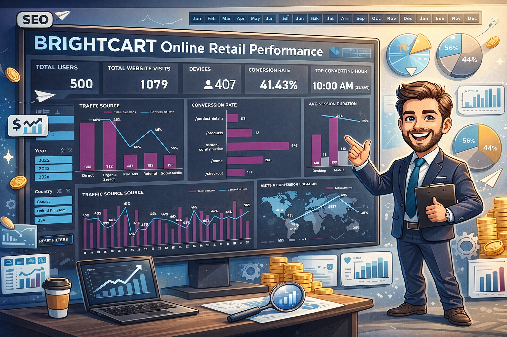

---

## Business Overview
**BrightCart Online Retail** is a rapidly growing e-commerce company that offers a wide range of products, including **consumer electronics, home goods, and lifestyle items.** Established in 2010 by a team of technology entrepreneurs, the company is dedicated to providing a smooth and convenient online shopping experience through **personalized product recommendations, competitive pricing, and efficient delivery services.**

By leveraging digital innovation and data-driven decision-making, BrightCart focuses on **improving customer engagement, increasing conversion rates**, and **maintaining a strong competitive position** in the evolving online retail industry.

---

## Business Problem 
**BrightCart** faces noticeable fluctuations in website traffic and conversion performance, making it challenging to effectively optimize marketing strategies and customer engagement.

**1.Traffic Timing Uncertainty**
- Limited visibility into peak user activity hours makes it difficult to schedule promotions, email campaigns, and website updates at the most effective times.

**2. Traffic Source Performance**
- Insufficient insight into how different acquisition channels, such as organic search, paid advertising, social media, and referrals, contribute to overall traffic and conversions.

**3. Conversion Optimization**
- Periods of high traffic with low purchase intent result in reduced conversion efficiency and potential waste of marketing resources.

**4. Customer Behavior Insights**
- A lack of detailed understanding of user interaction patterns restricts the company’s ability to implement effective personalization and targeted marketing strategies.

---

## Project Objectives
This Excel project was designed to achieve the following objectives:

**1. Identify Peak Traffic Periods**
- Analyze user activity by hour to determine the optimal timing for promotions and campaigns.

**2. Evaluate Traffic Sources**
- Assess the performance of channels such as organic search, paid ads, social media, and referrals.

**3. Improve Conversion Efficiency**
- Identify periods of high traffic but low conversions to optimize marketing efforts.

**4. Understand Customer Behavior**
- Examine user interaction patterns to support targeted marketing and personalization.

**5. Enable Data-Driven Decisions**
- Provide insights and dashboards to support strategic marketing and business decisions.

---

## Data Dictionary and Modelling
- **Session_ID:** Unique identifier for each website session
- **User_ID:** Unique identifier for each visitor or customer
- **Timestamp:** Date and time of the session
- **Time_of_Day:** Derived from Timestamp; indicates morning, afternoon, evening, or hour of the session
- **Traffic_Source:** Origin of the traffic (e.g., Organic, Paid, Social, Email, Referral, Direct)
- **Device_Type:** Type of device used (Desktop, Mobile, Tablet)
- **Location:** Geographic location of the user (City/Region)
- **Conversion_Flag:** Indicates if the session led to a purchase (1 = Yes, 0 = No)
- **User_Age:** Age of the user/visitor
- **User_Gender:** Gender of the user/visitor
- **Purchase_History_Count:** Total number of past purchases by the user
- **Page_Views** Number of pages viewed during the session
- **User Type:** New or Returning Users

  

---

## Approach & Methodology
This project was developed with Microsoft Excel.
### 1. Data Cleaning & Transformation (Excel Power Query)
- Imported raw customer data into
- Performed data cleaning and transformation:
  - removed duplicates and filtered invalid or missing entries
  - renamed columns and standardized field formats (e.g., text, numeric, dates)
- Ensured consistency and data quality for downstream modeling
- Created **calculated tables and columns** for data normaization and modelling
 
### 2. DAX Measures (Power Pivot)
- Created calculated fields to support key metrics and business logic
- Applied dimensions and calculated measures to support dynamic and filter-aware analysis across year, user type, traffic channel, and location.

### 3. Interactive Visualization & Dashboard Design (Excel Pivot Table & Worksheet)
- Developed a comprehensive suite of interactive dashboards using Excel Dashboard

### 4. Insight Generation & Business Alignment
- Identified key customer behavior patterns, traffic timing, website visits, and conversion rate
- Translated findings into actionable business recommendations

---

## 📊 Traffic Timing and Conversion Overview

  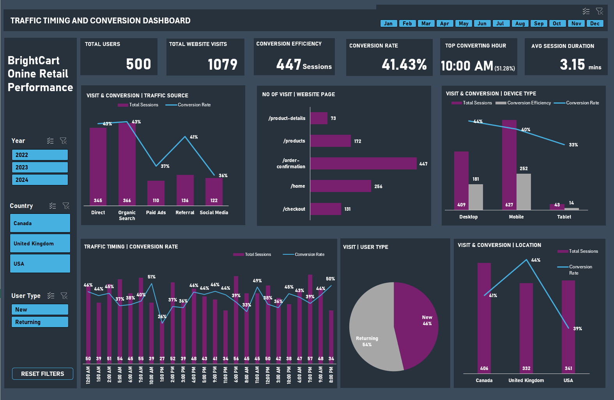

### Top KPIs (Key Performance Indicators)
- Total Users: 500
- Total website Visits: 1079
- Conversion Efficiency: 447 sessions
- Conversion Rate: 41.43%
- Top Converting Hour: 10:00 AM (51.28%)
- Average Session Duration: 3.15 mins

### Traffic Source Performance
**Key Insight**
- Organic Search and Direct channels generate the highest session volumes (366 and 346) while maintaining strong conversion rates (~43%)
- In contrast, Paid Ads and Social Media contribute significantly lower traffic and conversions
- Referrals generate a high conversion rate of 41% with a low traffic of 136 sessions
  
**Business Implication**

Marketing resources may be disproportionately allocated to lower-performing acquisition channels.

**Recommendation**
- Prioritize investment in SEO and organic content strategies
- Strengthen initiatives that drive direct traffic
- Optimize paid advertising through improved targeting and creative performance

**Expected Impact**
- Improved marketing efficiency, stronger ROI on acquisition channels, and more sustainable traffic growth.

  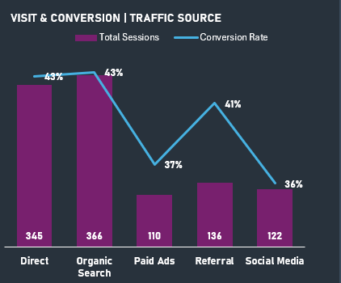

## Website Page Interaction
**Key Insight**
- The Order Confirmation page records the highest visits (447), followed by the Home Page (256), Product Listing (172), and Checkout (131).
- Product Detail pages show the lowest engagement (73), indicating limited interaction with product information before purchase.

**Business Implication**

Low engagement with product pages suggests missed opportunities to influence purchase decisions, while potential friction in the checkout process may hinder conversion efficiency.

**Recommendation**
- Enhance product discovery with stronger call-to-action elements, improved product visuals, and quick-view features
- Optimize product detail pages by highlighting reviews, ratings, and promotions
- Streamline the checkout experience through simplified steps, guest checkout options, and transparent shipping costs

**Expected Impact**

Improved conversion rates and an estimated revenue uplift of up to 20% by maximizing value from existing traffic.

  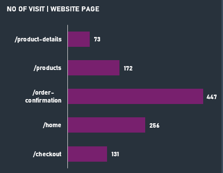

### Device Behaviour
**Key Insight**
- Mobile generates the highest traffic and conversion efficiency (627 and 252)
- However, the desktop conversion rate remains slightly higher

**Business Implication**

Mobile users represent the largest opportunity for conversion optimization.

**Recommendation**
- Improve mobile checkout experience and page speed
- Simplify mobile purchase flows
- Optimize mobile product pages and CTAs

**Expected Impact**
- Increased mobile conversion rates
- Higher overall sales volume

  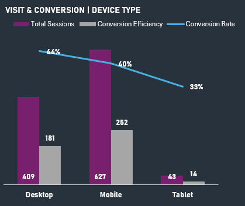

## Conversion Rate VS Traffic Timing
**Key Insight**
- Strong session volumes are occurring during early morning and evening periods
- However, some high-traffic hours (>=50 sessions) show a lower conversion rate (<40%), indicating missed opportunities. E.g., 5 am, 12 pm, 2 pm, 6 pm, and 7 pm.

**Business Implication**

Marketing activities are not currently aligned with the highest purchase-intent windows, reducing campaign effectiveness.

**Recommendation**
- Schedule email campaigns, flash sales, and promotional banners between 9 AM and 11 AM, where conversion probability is highest.
- Use behavior-triggered messaging (cart reminders, personalized offers) during low-conversion periods
- Align inventory updates and website refreshes before peak hours to capture purchase intent

**Expected Impact**
- Higher campaign ROI
- Improved conversion by 25% during peak traffic windows
- Better utilization of marketing spend

  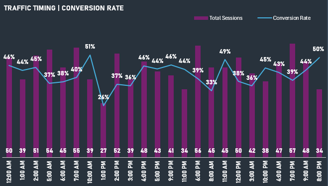

## Customer Segment Behavior
**Key Insight**
- Returning users represent 54% of traffic, indicating strong customer loyalty
- New users account for 46%, showing healthy acquisition

**Business Implication**
- Returning users present a high-value segment for retention and upselling

**Recommendation**
- Introduce loyalty rewards and personalized offers for returning customers
- Use behavioral targeting for new visitors to accelerate first purchase

**Expected Impact**
- Improved customer lifetime value
- Increased repeat purchases

  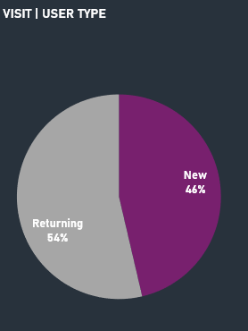

## Geographic Performance
**Key Insight**
- Canada generates the highest traffic volume (406 sessions)
- The United Kingdom shows the highest conversion rate (44%)
- USA conversion is slightly lower (39%)

**Business Implication**

Different markets show varying purchase behavior and potential for growth.

**Recommendation**
- Prioritize conversion optimization strategies in the USA
- Expand marketing campaigns in the UK, where purchase intent is strongest
- Maintain strong engagement strategies in Canada due to high traffic volume.

**Expected Impact**
- Better geographic marketing allocation
- Higher international sales performance

  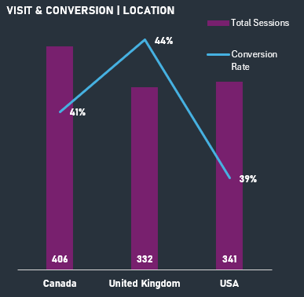

## 🔢 Customers' Behavior and Page Interaction Overview

  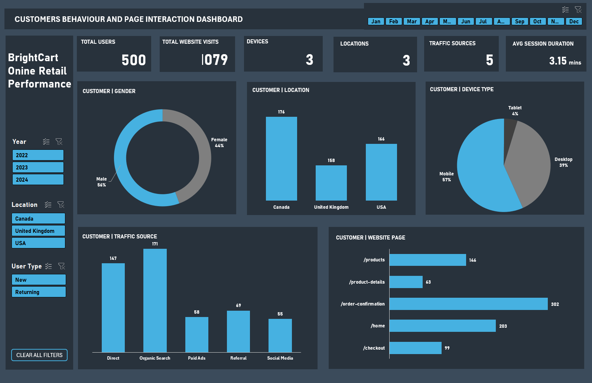

### Top KPIs (Key Performance Indicators)
- Total Users: 500
- Total website Visits: 1079
- Devices: 3
- Locations: 3
- Traffic Source: 5
- Average Session Duration: 3.15 mins

### 📊 Customer Demographic
**Key Insight**
- Customer distribution shows 56% male and 44% female users, indicating a relatively balanced audience with a slight male dominance.

**Business Implication**
- Marketing messaging may not be fully optimized for the different preferences of each customer segment.

**Recommendation**
- Introduce segment-specific marketing campaigns tailored to gender-based preferences
- Personalize product recommendations and promotional messaging

**Expected Impact**
- Higher engagement and improved personalization effectiveness

  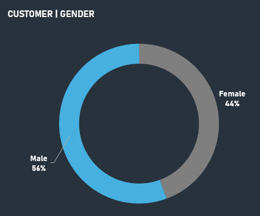

### Customer Geographic Distribution
**Key insight**
- Canada: 176 users (largest audience)
- USA: 166 users
- United Kingdom: 158 users

**Recommendation**
- Maintain strong engagement strategies in Canada, where customer concentration is highest
- Expand targeted campaigns in the USA and the United Kingdom to grow market share

**Expected impact**
- Improved regional marketing efficiency and international growth by 20%

  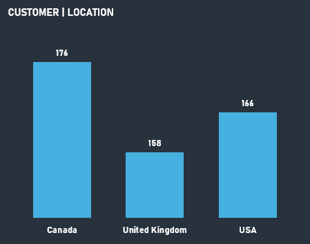

## Device Usage Behavior
**Key Insight**
- Mobile accounts for the majority of users (57%)
- Desktop contributes 39%, while tablet usage is minimal (4%).

**Business Implication**

Most customers interact with BrightCart on mobile devices, making the mobile experience critical to conversion.

**Recommendation**
- Prioritize mobile-first website optimization
- Improve mobile navigation, product page loading speed, and checkout flow
- Optimize mobile promotional banners and CTAs

**Expected Impact**
- Increased conversion rates from the largest user segment.

  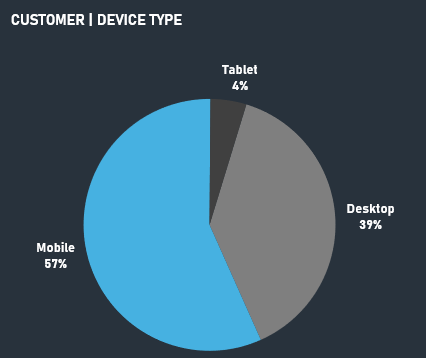

## Traffic Source Performance
**Business Implication**
- Organic search is the most effective customer acquisition channel, while paid advertising and social channels contribute significantly less

**Recommendation**
- Increase investment in SEO and content marketing
- Optimize paid advertising targeting to improve acquisition efficiency
- Strengthen referral partnerships to expand reach

**Expected Impact**
- Potential to increase quality traffic with better conversion potential by 25% 

  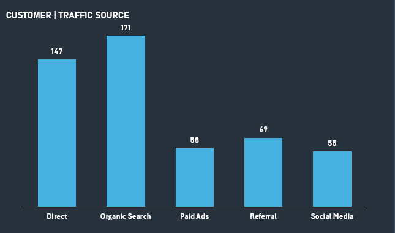

## Website Page Interaction
**Business Implication**
- There may be friction in the purchase journey, preventing users from progressing smoothly from browsing to checkout.

**Recommendation**
- Improve product detail page engagement with clearer descriptions, reviews, and images
- Simplify the checkout process to reduce drop-offs
- Introduce call-to-action prompts guiding users from product pages to purchase

**Expected Impact**
- Improved customer journey flow
- Increase purchase completion rates by 15%

  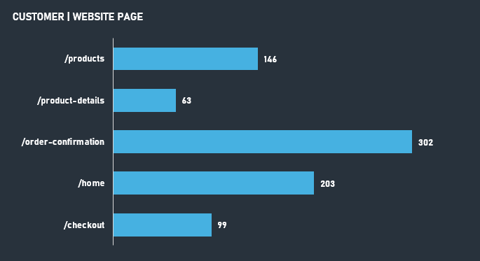

---

## Executive Summary

This analysis of BrightCart’s website traffic, customer behavior, and conversion performance identifies several opportunities to strengthen marketing effectiveness and improve overall sales outcomes. The dashboard insights reveal that user engagement and conversion patterns vary across different time periods, traffic sources, devices, and browsing behaviors. These findings highlight the importance of adopting a more data-driven approach to marketing strategy and customer experience optimization.

Key insights from the analysis show that:

- Traffic and conversion performance vary significantly by time of day, acquisition channel, and device type
- Organic Search and Direct traffic consistently drive the highest engagement and strong conversion performance
- Mobile users represent the majority of website visitors, emphasizing the importance of mobile-first optimization
- Product detail pages show relatively low engagement, indicating gaps in the customer purchase journey
- Improving the transition from product discovery to checkout presents an opportunity to increase overall conversion rates

## Executive Recommendation

**BrightCart** should implement a **targeted, data-driven strategy** focused on the following priorities:

1. Strengthen **SEO and organic content strategies** to sustain high-performing traffic channels

2. Invest in **brand-driven initiatives** that encourage direct website visits

3. Adopt a **mobile-first optimization strategy** to improve browsing, navigation, and checkout experience

4. Enhance **product discovery and product detail pages** to encourage deeper engagement before purchase

5. Align **marketing campaigns with peak engagement periods** to maximize conversion opportunities

By leveraging these insights, **BrightCart** can improve marketing efficiency, optimize customer experience, and increase conversion performance while supporting sustainable growth in a competitive online retail environment.

---

## Connect With Me
- 💼 **LinkedIn:** (https://www.linkedin.com/in/david-okeleye001/)
- 📧 **Email:** okeleyedavid2021@gmail.com
- 🌐 **Portfolio:** https://bit.ly/3N5c1p7
- 🐙 **GitHub:** https://github.com/olavidz01-dev
